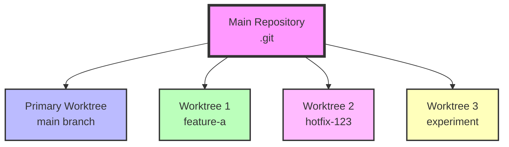
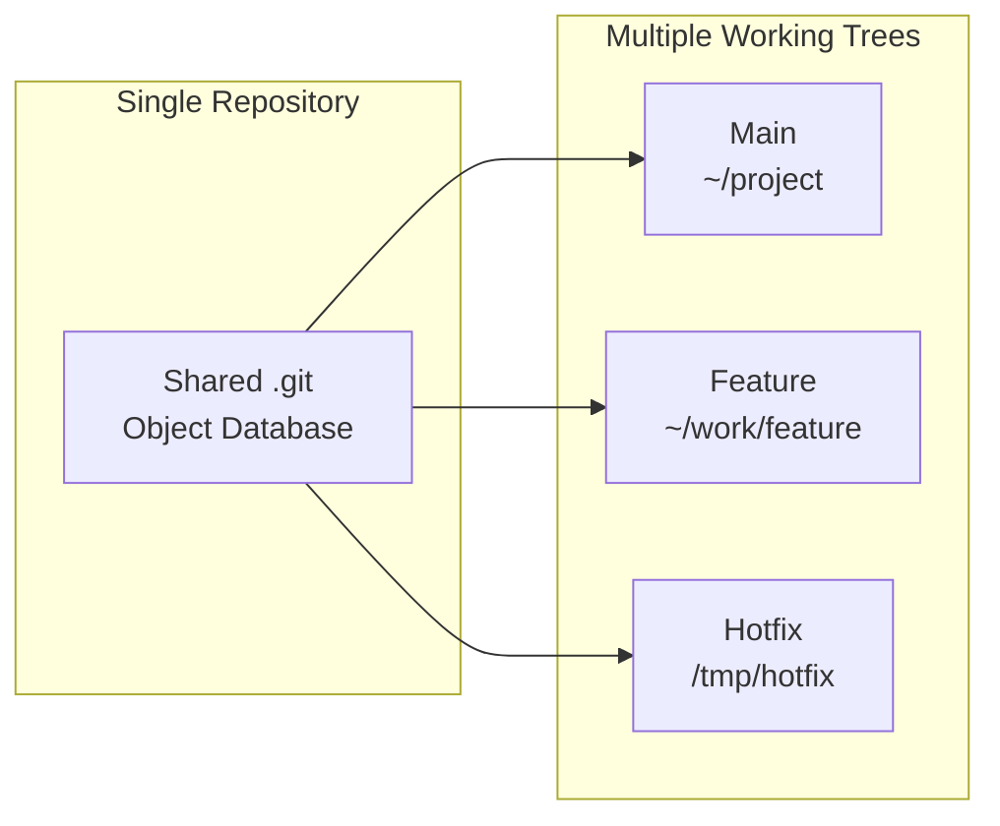
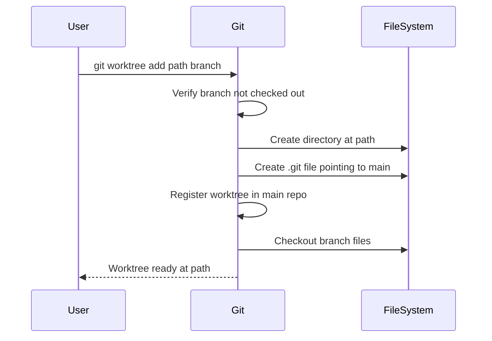
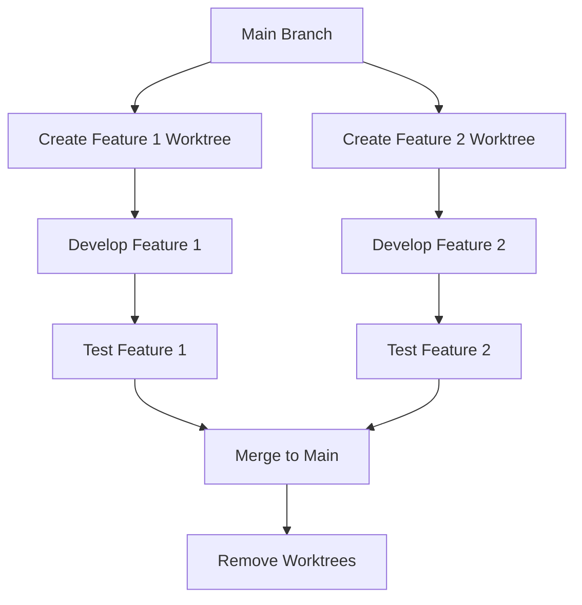

# Git Worktree — Complete Guide

## TL;DR

Git worktree allows you to have multiple working directories attached to the same repository, enabling you to work on different branches simultaneously without the overhead of cloning or stashing changes.

**Quick Start:**

```bash
# Create a worktree for a branch
git worktree add ~/work/feature feature-branch

# List all worktrees
git worktree list

# Remove when done
git worktree remove ~/work/feature
```

## Table of Contents

1. [What is Git Worktree?](#what-is-git-worktree)
2. [Installation and Availability](#installation-and-availability)
3. [Commands Overview](#commands-overview)
4. [Command Reference](#command-reference)
   - [add](#git-worktree-add)
   - [list](#git-worktree-list)
   - [remove](#git-worktree-remove)
   - [move](#git-worktree-move)
   - [prune](#git-worktree-prune)
   - [lock/unlock](#git-worktree-lock--unlock)
   - [repair](#git-worktree-repair)
5. [Common Use Cases](#common-use-cases)
6. [Examples](#examples)
7. [Best Practices](#best-practices)
8. [Troubleshooting](#troubleshooting)
9. [Quick Reference](#quick-reference)
10. [Further Reading](#further-reading)

## What is Git Worktree?

Git worktree is a feature that allows you to have multiple working trees (directories) attached to a single repository. Each worktree can have a different branch checked out, enabling parallel development without the need for stashing, cloning, or branch switching.

### How It Works



### Key Concepts



### Worktree vs Other Approaches

| Approach          | Pros                                                 | Cons                                | Best For                 |
| ----------------- | ---------------------------------------------------- | ----------------------------------- | ------------------------ |
| **Worktree**      | Shared storage, instant branch switch, parallel work | Can't checkout same branch twice    | Multiple active branches |
| **Clone**         | Complete isolation, can push/pull independently      | Duplicate storage, separate remotes | Independent projects     |
| **Stash**         | Simple, built-in                                     | Mental overhead, easy to forget     | Quick context switches   |
| **Branch Switch** | No extra setup                                       | Lose working state, rebuild needed  | Sequential work          |

## Installation and Availability

Git worktree has been available since Git 2.5.0 (July 2015) and is included in all modern Git installations.

### Check Availability

```bash
# Test if worktree is available
git worktree -h | cat

# Check Git version (needs 2.5.0+)
git --version | cat

# Check current worktrees
git worktree list
```

### Version History

- **Git 2.5.0**: Initial worktree support
- **Git 2.7.0**: Added `lock` and `unlock`
- **Git 2.17.0**: Added `move` command
- **Git 2.18.0**: Added `remove` command
- **Git 2.20.0**: Improved `prune` behavior
- **Git 2.30.0**: Added `repair` command

## Commands Overview

| Command    | Purpose                   | Basic Syntax                         |
| ---------- | ------------------------- | ------------------------------------ |
| **add**    | Create new worktree       | `git worktree add <path> [<branch>]` |
| **list**   | Show all worktrees        | `git worktree list [--porcelain]`    |
| **remove** | Delete a worktree         | `git worktree remove <path>`         |
| **move**   | Relocate a worktree       | `git worktree move <old> <new>`      |
| **prune**  | Clean up stale worktrees  | `git worktree prune`                 |
| **lock**   | Prevent automatic removal | `git worktree lock <path>`           |
| **unlock** | Allow automatic removal   | `git worktree unlock <path>`         |
| **repair** | Fix worktree corruption   | `git worktree repair [<path>]`       |

## Command Reference

### git worktree add

Creates a new working tree at the specified path.

#### Synopsis

```bash
git worktree add [options] <path> [<commit-ish>]
git worktree add [options] <path> -b <new-branch> [<commit-ish>]
git worktree add [options] <path> --detach [<commit-ish>]
git worktree add [options] <path> --orphan <new-branch>
```

#### Options

- `<path>`: **Required**. Directory for the new worktree (created if doesn't exist)
- `<commit-ish>`: Branch, tag, or commit to checkout (defaults to HEAD)
- `-b <new-branch>`: Create and checkout a new branch
- `-B <new-branch>`: Create/reset and checkout a branch
- `--detach`: Checkout in detached HEAD state
- `--orphan`: Create orphan branch (no parent commits)
- `-f, --force`: Force creation even if path exists
- `--checkout/--no-checkout`: Control whether to checkout files
- `--lock`: Lock worktree immediately after creation
- `--reason <string>`: Lock reason (with --lock)
- `-q, --quiet`: Suppress output
- `--track/--no-track`: Set upstream tracking

#### Behavior



#### Examples

```bash
# Add worktree for existing branch
git worktree add ~/work/bugfix bugfix-123

# Create new branch in worktree
git worktree add -b feature-new ~/work/feature

# Add worktree for specific commit
git worktree add ~/work/test-old-version v1.2.3

# Detached HEAD at specific commit
git worktree add --detach ~/work/bisect HEAD~10

# Create without checking out files
git worktree add --no-checkout ~/work/sparse feature-sparse

# Force create and reset branch
git worktree add -B experimental ~/work/experiment origin/experimental

# Create locked worktree
git worktree add --lock --reason "long-running test" ~/work/test test-branch

# Track remote branch
git worktree add --track -b feature ~/work/feature origin/feature
```

### git worktree list

Lists all working trees associated with the repository.

#### Synopsis

```bash
git worktree list [--porcelain] [-z] [-v]
```

#### Options

- `--porcelain`: Machine-readable output
- `-z`: Terminate lines with NUL (with --porcelain)
- `-v, --verbose`: Show more information

#### Output Format

Normal output:

```
<path> <commit> [<branch>] [locked]
```

Porcelain output:

```
worktree <path>
HEAD <commit>
branch <ref>
locked <reason>  # if locked
prunable <reason>  # if prunable
```

#### Examples

```bash
# Basic list
git worktree list

# Verbose with more details
git worktree list -v

# Machine-readable format
git worktree list --porcelain

# Parse in scripts (NUL-terminated)
git worktree list --porcelain -z

# Pretty formatted list with column
git worktree list | column -t

# Check status with additional info
git worktree list | while read path commit branch; do
    echo "Worktree: $path"
    echo "  Commit: $commit"
    echo "  Branch: $branch"
    echo "  Status: $(cd "$path" 2>/dev/null && git status -s | wc -l) modified files"
    echo
done
```

### git worktree remove

Removes a working tree.

#### Synopsis

```bash
git worktree remove [-f] <worktree>
```

#### Options

- `<worktree>`: Path to the worktree to remove
- `-f, --force`: Force removal even with uncommitted changes

#### Behavior

- Removes worktree directory and registration
- Fails if worktree has uncommitted changes (unless forced)
- Cannot remove main worktree
- Cannot remove locked worktree (must unlock first)

#### Examples

```bash
# Remove worktree
git worktree remove ~/work/feature

# Force remove with uncommitted changes
git worktree remove -f ~/work/experiment

# Remove by relative path
cd ~/work
git worktree remove ./bugfix

# Remove multiple worktrees
for path in ~/work/feature-*; do
    git worktree remove "$path"
done

# Safe remove with check
if git -C ~/work/feature diff --quiet && \
   git -C ~/work/feature diff --cached --quiet; then
    git worktree remove ~/work/feature
else
    echo "Worktree has uncommitted changes"
fi
```

### git worktree move

Moves a working tree to a new location.

#### Synopsis

```bash
git worktree move <worktree> <new-path>
```

#### Options

- `<worktree>`: Current path of the worktree
- `<new-path>`: New location for the worktree

#### Behavior

- Moves worktree directory to new location
- Updates repository references
- Preserves all uncommitted changes
- Cannot move locked worktree
- Cannot move main worktree

#### Examples

```bash
# Move to new location
git worktree move ~/work/feature ~/projects/feature

# Rename worktree
git worktree move ~/work/old-name ~/work/new-name

# Move to temporary location
git worktree move ~/work/experiment /tmp/experiment

# Organize worktrees
mkdir -p ~/work/features ~/work/bugfixes
git worktree move ~/work/feature-auth ~/work/features/auth
git worktree move ~/work/bugfix-123 ~/work/bugfixes/123
```

### git worktree prune

Removes stale worktree references.

#### Synopsis

```bash
git worktree prune [-n] [-v] [--expire <time>]
```

#### Options

- `-n, --dry-run`: Show what would be pruned
- `-v, --verbose`: Show pruning details
- `--expire <time>`: Only prune older than specified time

#### When Worktrees Become Stale

- Directory manually deleted
- Directory on unmounted filesystem
- Directory on network drive that's offline
- Corrupted worktree references

#### Examples

```bash
# Prune stale worktrees
git worktree prune

# Dry run to see what would be removed
git worktree prune -n -v

# Prune worktrees older than 3 months
git worktree prune --expire=3.months.ago

# Verbose pruning
git worktree prune -v

# Check and prune
git worktree list
git worktree prune
git worktree list  # Verify cleanup
```

### git worktree lock / unlock

Prevents or allows automatic removal of a working tree.

#### Synopsis

```bash
git worktree lock [--reason <string>] <worktree>
git worktree unlock <worktree>
```

#### Options

- `<worktree>`: Path to the worktree
- `--reason <string>`: Human-readable reason for locking

#### Use Cases

- Long-running processes
- Worktrees on removable media
- Preventing accidental removal
- Temporary network mounts

#### Examples

```bash
# Lock with reason
git worktree lock --reason "Running 24-hour test suite" ~/work/test

# Simple lock
git worktree lock ~/work/important

# Unlock
git worktree unlock ~/work/test

# Check lock status
git worktree list --porcelain | grep -A1 "worktree.*test"

# Lock all worktrees
git worktree list --porcelain | \
    grep "^worktree" | \
    cut -d' ' -f2 | \
    while read path; do
        git worktree lock --reason "Backup in progress" "$path"
    done
```

### git worktree repair

Repairs administrative files if worktree or repository is moved.

#### Synopsis

```bash
git worktree repair [<path>...]
```

#### Options

- `<path>`: Specific worktree paths to repair (repairs all if omitted)

#### When to Use

- After moving repository manually
- After restoring from backup
- After filesystem corruption
- Network drive reconnection issues

#### Examples

```bash
# Repair all worktrees
git worktree repair

# Repair specific worktree
git worktree repair ~/work/feature

# Repair after repository move
cd /new/location/of/main/repo
git worktree repair

# Repair multiple specific worktrees
git worktree repair ~/work/feature ~/work/bugfix

# Check and repair
git worktree list
git worktree repair
git worktree list  # Verify repair
```

## Common Use Cases

### Parallel Feature Development



```bash
# Setup parallel development
git worktree add ~/work/feature-auth feature/authentication
git worktree add ~/work/feature-api feature/api-integration

# Work on features independently
cd ~/work/feature-auth
# ... development ...

cd ~/work/feature-api
# ... development ...

# Review both features
diff -r ~/work/feature-auth ~/work/feature-api

# Merge when ready
cd ~/src/main-repo
git merge feature/authentication
git merge feature/api-integration

# Cleanup
git worktree remove ~/work/feature-auth
git worktree remove ~/work/feature-api
```

### Quick Bug Fixes Without Stashing

```bash
# Working on feature, urgent bug reported
pwd  # ~/src/project on feature branch

# Create hotfix worktree
git worktree add -b hotfix-urgent ~/work/hotfix main

# Fix bug
cd ~/work/hotfix
vim src/critical.js
git add -A
git commit -m "fix: urgent production issue"
git push origin hotfix-urgent

# Return to feature work (nothing lost!)
cd ~/src/project
# Continue exactly where you left off

# Cleanup after merge
git worktree remove ~/work/hotfix
```

### Code Review Workflow

```bash
# Create worktrees for each PR
git fetch origin
git worktree add ~/review/pr-123 origin/pr-123
git worktree add ~/review/pr-124 origin/pr-124

# Review and test each PR
cd ~/review/pr-123
npm test
# Review code...

cd ~/review/pr-124
npm test
# Review code...

# Compare implementations
diff -r ~/review/pr-123/src ~/review/pr-124/src

# Cleanup after review
git worktree remove ~/review/pr-123
git worktree remove ~/review/pr-124
```

### Building Different Versions

```bash
# Setup builds for multiple versions
git worktree add ~/build/v1 v1.0.0
git worktree add ~/build/v2 v2.0.0
git worktree add ~/build/main main

# Build each version
for version in v1 v2 main; do
    cd ~/build/$version
    npm install
    npm run build
    echo "Built $version"
done

# Compare build outputs
ls -la ~/build/*/dist/

# Keep for ongoing testing
git worktree lock --reason "CI/CD reference builds" ~/build/v1
git worktree lock --reason "CI/CD reference builds" ~/build/v2
```

### Bisecting Without Disruption

```bash
# Start bisect in separate worktree
git worktree add ~/debug/bisect --detach

cd ~/debug/bisect
git bisect start
git bisect bad HEAD
git bisect good v1.0.0

# Run bisect
while ! git bisect good || git bisect bad; do
    npm test
    if [ $? -eq 0 ]; then
        git bisect good
    else
        git bisect bad
    fi
done

# Found the bad commit
git bisect reset
cd ~/src/project
git worktree remove ~/debug/bisect
```

### Experimenting Safely

```bash
# Create experimental worktree
git worktree add -b experiment ~/lab/crazy-idea

cd ~/lab/crazy-idea
# Go wild with experiments
rm -rf old-architecture/
git add -A
git commit -m "experiment: complete rewrite"

# If experiment succeeds
cd ~/src/project
git merge experiment

# If experiment fails
git branch -D experiment
git worktree remove ~/lab/crazy-idea
```

## Examples

### Complete Project Workflow

```bash
#!/bin/bash
# Project workflow with worktrees

PROJECT_ROOT="$HOME/src/myproject"
WORK_ROOT="$HOME/work"

# Initial setup
cd "$PROJECT_ROOT"

# 1. Create feature worktree
echo "Creating feature worktree..."
git worktree add -b feature/new-dashboard "$WORK_ROOT/dashboard"

# 2. Create bugfix worktree
echo "Creating bugfix worktree..."
git worktree add "$WORK_ROOT/bugfix" main
cd "$WORK_ROOT/bugfix"
git checkout -b bugfix/memory-leak

# 3. List all worktrees
echo "Current worktrees:"
git worktree list | cat

# 4. Work on feature
cd "$WORK_ROOT/dashboard"
echo "// New dashboard code" > dashboard.js
git add dashboard.js
git commit -m "feat: add dashboard"

# 5. Work on bugfix
cd "$WORK_ROOT/bugfix"
echo "// Fix memory leak" > fix.js
git add fix.js
git commit -m "fix: memory leak in worker"

# 6. Check status of all worktrees
for worktree in $(git worktree list --porcelain | grep "^worktree" | cut -d' ' -f2); do
    echo "Status of $worktree:"
    git -C "$worktree" status -s
done

# 7. Push branches
cd "$WORK_ROOT/dashboard"
git push -u origin feature/new-dashboard

cd "$WORK_ROOT/bugfix"
git push -u origin bugfix/memory-leak

# 8. Cleanup
echo "Cleaning up worktrees..."
git worktree remove "$WORK_ROOT/dashboard"
git worktree remove "$WORK_ROOT/bugfix"

echo "Workflow complete!"
```

### Worktree Manager Script

```bash
#!/usr/bin/env bash
# wt-manager: Worktree management helper

# Set base directory for worktrees
WT_BASE="${WORKTREE_BASE:-$HOME/work}"

wt_add() {
    local branch="$1"
    local dir_name="${2:-$branch}"
    local path="$WT_BASE/$dir_name"

    mkdir -p "$WT_BASE"
    git worktree add "$path" "$branch"
    echo "Created worktree at: $path"
    cd "$path"
}

wt_list() {
    git worktree list | column -t
}

wt_clean() {
    # Remove all worktrees except main
    git worktree list --porcelain | \
        grep "^worktree" | \
        cut -d' ' -f2 | \
        grep -v "$(git rev-parse --show-toplevel)" | \
        while read -r path; do
            echo "Removing: $path"
            git worktree remove "$path"
        done
}

wt_switch() {
    local name="$1"
    local path="$WT_BASE/$name"

    if [ -d "$path" ]; then
        cd "$path"
    else
        echo "Worktree not found: $path"
        echo "Available worktrees:"
        wt_list
    fi
}

# Usage
case "${1:-list}" in
    add)    wt_add "$2" "$3" ;;
    list)   wt_list ;;
    clean)  wt_clean ;;
    switch) wt_switch "$2" ;;
    *)      echo "Usage: $0 {add|list|clean|switch}" ;;
esac
```

## Best Practices

### ✅ DO

1. **Use descriptive paths** - Name worktree directories after their purpose

   ```bash
   git worktree add ~/work/bugfix-login-issue bugfix/login
   git worktree add ~/work/feature-v2-api feature/api-v2
   ```

2. **Clean up after yourself** - Remove worktrees when done

   ```bash
   git worktree remove ~/work/completed-feature
   git worktree prune  # Periodic cleanup
   ```

3. **Lock long-running worktrees** - Prevent accidental removal

   ```bash
   git worktree lock --reason "Performance testing for 48h" ~/work/perf-test
   ```

4. **Use consistent structure** - Organize worktrees logically

   ```bash
   ~/work/
   ├── features/
   │   ├── auth/
   │   └── api/
   ├── bugfixes/
   │   └── urgent/
   └── experiments/
   ```

5. **Check before removing** - Verify no uncommitted work
   ```bash
   git -C ~/work/feature status
   git worktree remove ~/work/feature
   ```

### ❌ DON'T

1. **Don't check out the same branch twice** - Git prevents this

   ```bash
   # This will fail if 'main' is already checked out
   git worktree add ~/work/main2 main
   ```

2. **Don't manually delete worktree directories** - Use `git worktree remove`

   ```bash
   # Wrong
   rm -rf ~/work/feature

   # Right
   git worktree remove ~/work/feature
   ```

3. **Don't nest worktrees** - Keep them as siblings

   ```bash
   # Wrong
   git worktree add ~/work/feature/sub-feature

   # Right
   git worktree add ~/work/sub-feature
   ```

4. **Don't forget about worktrees** - List them periodically

   ```bash
   git worktree list
   ```

5. **Don't move repository without repair** - Fix references after moves
   ```bash
   # After moving main repository
   git worktree repair
   ```

### Performance Considerations

```bash
# Worktrees share object database - efficient!
du -sh .git/objects  # Shared by all worktrees

# Each worktree has minimal overhead
du -sh ~/work/feature/.git  # Just a file, not a directory

# Fetch once, available everywhere
git fetch origin  # Updates all worktrees' view

# Garbage collection affects all worktrees
git gc  # Cleans shared object database
```

## Troubleshooting

### Common Issues

#### "fatal: branch already checked out"

```bash
# Problem: Branch is checked out in another worktree
git worktree list  # Find where it's checked out

# Solution 1: Use a different branch
git worktree add ~/work/feature2 -b feature-new

# Solution 2: Remove the other worktree
git worktree remove ~/work/old-feature
git worktree add ~/work/feature feature-branch
```

#### Worktree directory deleted manually

```bash
# Problem: Directory removed without git worktree remove
rm -rf ~/work/feature  # Oops!

# Solution: Prune stale references
git worktree prune
git worktree list  # Verify cleanup
```

#### "fatal: not a git repository"

```bash
# Problem: Worktree corrupted or moved

# Solution: Repair the worktree
git worktree repair ~/work/feature

# Or remove and recreate
git worktree prune
git worktree add ~/work/feature feature-branch
```

#### Cannot remove worktree with changes

```bash
# Problem: Uncommitted changes prevent removal
git worktree remove ~/work/feature
# fatal: 'feature' contains modified or untracked files

# Solution 1: Commit or stash changes
cd ~/work/feature
git stash
git worktree remove ~/work/feature

# Solution 2: Force removal
git worktree remove -f ~/work/feature
```

#### Worktree on network drive

```bash
# Problem: Network drive disconnected

# Solution: Lock when using network drives
git worktree add ~/network/feature feature-branch
git worktree lock --reason "Network drive" ~/network/feature

# Repair after reconnection
git worktree repair ~/network/feature
```

## Quick Reference

```bash
# Create worktree
git worktree add <path> <branch>
git worktree add -b <new-branch> <path>

# List worktrees
git worktree list
git worktree list --porcelain

# Remove worktree
git worktree remove <path>
git worktree remove -f <path>  # force

# Move worktree
git worktree move <old-path> <new-path>

# Lock/Unlock
git worktree lock <path>
git worktree unlock <path>

# Maintenance
git worktree prune
git worktree repair

# Common patterns
git worktree add ~/work/feature feature-branch
cd ~/work/feature
# ... work ...
git worktree remove ~/work/feature
```

## Advanced Tips

### Sparse Worktrees

```bash
# Create worktree without checkout
git worktree add --no-checkout ~/work/sparse feature

cd ~/work/sparse
git sparse-checkout init --cone
git sparse-checkout set src/module
git checkout
```

### Worktree Aliases

```bash
# Add to ~/.gitconfig or .git/config
[alias]
    wt = worktree
    wta = worktree add
    wtl = worktree list
    wtr = worktree remove
    wtm = worktree move

    # Custom: add worktree in standard location
    wtadd = "!f() { git worktree add ~/work/$1 $1; }; f"

    # Custom: cd to worktree
    wtcd = "!f() { cd $(git worktree list | grep $1 | cut -d' ' -f1); }; f"
```

### Integration with Tools

```bash
# VS Code: Open different worktrees
code ~/work/feature
code ~/work/bugfix

# tmux: One worktree per window
tmux new-window -n feature -c ~/work/feature
tmux new-window -n bugfix -c ~/work/bugfix

# Directory jumper (z, autojump, etc.)
cd ~/work/feature  # Registers path
z feature  # Jump back later
```

## Further Reading

- [Git Worktree Documentation](https://git-scm.com/docs/git-worktree)
- [Git Book - Git Tools](https://git-scm.com/book/en/v2/Git-Tools-Advanced-Merging)
- [GitHub Blog on Worktrees](https://github.blog/2020-06-26-git-2-27-highlights/#git-worktree)
- [Worktree Source Code](https://github.com/git/git/blob/master/builtin/worktree.c)

---

_Version: Compatible with Git 2.5.0+_  
_Last updated for Git 2.50.1_  
_Optimal with Git 2.30.0+ (includes `repair` command)_
