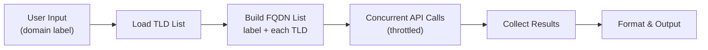
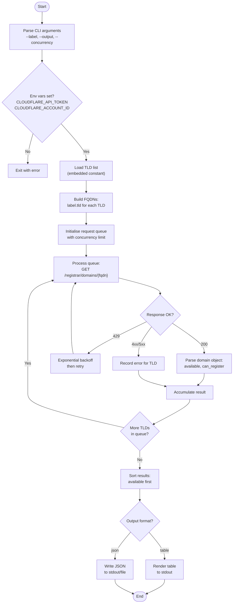
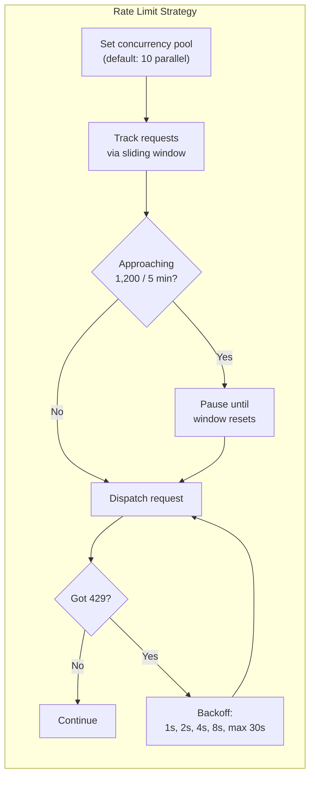
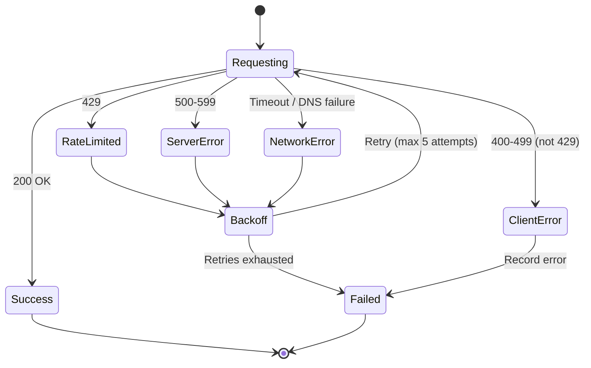

# PRD: Cloudflare Domain Availability Checker

**Version:** 1.0
**Author:** Dave Williams
**Date:** 2026-03-11

---

## 1. Overview

A CLI script that accepts a domain name (the label, e.g. `acme`) and checks its availability across all TLDs supported by Cloudflare Registrar. Results are presented in a structured, filterable format showing which domain+TLD combinations are available for registration.

---

## 2. Problem Statement

Cloudflare Registrar supports over 400 TLDs, but the dashboard's domain search UI returns a curated subset of suggestions rather than an exhaustive check. There is no built-in way to systematically query every supported TLD for a given label. This script fills that gap by automating availability lookups across the full TLD catalogue.

---

## 3. Goals & Non-Goals

### Goals

- Accept a single domain label as input and check availability across all Cloudflare-supported TLDs.
- Respect Cloudflare API rate limits to avoid `429` responses.
- Present results clearly, distinguishing between available, unavailable, and unsupported domains.
- Support output in both human-readable (table) and machine-readable (JSON) formats.

### Non-Goals

- Domain registration or purchase — this is read-only.
- Checking TLDs not supported by Cloudflare Registrar.
- Premium domain pricing lookups (not exposed via the API).

---

## 4. API Details

### 4.1 Endpoint

The script uses the **Get Domain** endpoint on the Cloudflare Registrar API:

```plaintext
GET https://api.cloudflare.com/client/v4/accounts/{account_id}/registrar/domains/{domain_name}
```

Where `{domain_name}` is the fully-qualified domain, e.g. `acme.com`, `acme.io`, `acme.co.uk`.

### 4.2 Authentication

| Header          | Value                          |
| --------------- | ------------------------------ |
| `Authorization` | `Bearer $CLOUDFLARE_API_TOKEN` |

The API token must have **Registrar** read permissions. The token and account ID are sourced from environment variables.

### 4.3 Response Schema (Domain Object)

Key fields from the `Domain` response object:

| Field               | Type      | Description                                          |
| ------------------- | --------- | ---------------------------------------------------- |
| `id`                | `string`  | Internal domain identifier                           |
| `available`         | `boolean` | Whether the domain is available for registration     |
| `can_register`      | `boolean` | Whether the domain can be registered via Cloudflare  |
| `supported_tld`     | `boolean` | Whether the TLD is supported by Cloudflare Registrar |
| `current_registrar` | `string`  | Current registrar name (if registered)               |
| `expires_at`        | `string`  | Expiration date (if registered)                      |

### 4.4 Rate Limits

The Cloudflare API enforces a global rate limit of **1,200 requests per 5 minutes** per user/token. This applies cumulatively across all API calls (dashboard, tokens, keys).

| Limit             | Value                                        |
| ----------------- | -------------------------------------------- |
| Per user/token    | 1,200 requests / 5 minutes                   |
| Per IP            | 200 requests / second                        |
| Penalty on breach | All calls blocked for 5 minutes (`HTTP 429`) |

With **413 supported TLDs** in the catalogue, a single full sweep fits comfortably within the 1,200-request window. The script should still implement concurrency throttling and backoff to be a good citizen.

---

## 5. Architecture

### 5.1 High-Level Flow



### 5.2 Detailed Execution Flow



### 5.3 Rate Limit Strategy



---

## 6. Configuration

### 6.1 Environment Variables

| Variable                | Required | Description                               |
| ----------------------- | -------- | ----------------------------------------- |
| `CLOUDFLARE_API_TOKEN`  | Yes      | API token with Registrar read permissions |
| `CLOUDFLARE_ACCOUNT_ID` | Yes      | Cloudflare account identifier             |

### 6.2 CLI Arguments

| Argument               | Default | Description                                       |
| ---------------------- | ------- | ------------------------------------------------- |
| `<label>`              | —       | The domain label to check (positional, required)  |
| `--output` / `-o`      | `table` | Output format: `table` or `json`                  |
| `--concurrency` / `-c` | `10`    | Max parallel requests                             |
| `--filter` / `-f`      | `all`   | Filter results: `all`, `available`, `unavailable` |
| `--tlds` / `-t`        | (all)   | Comma-separated subset of TLDs to check           |
| `--out-file`           | —       | Write output to file instead of stdout            |

---

## 7. TLD Catalogue

The script embeds the full list of **413 Cloudflare-supported TLDs** as a constant. This list should be periodically reviewed against the [Cloudflare TLD support page](https://www.cloudflare.com/tld-policies/).

Notable considerations:

- **Multi-level TLDs** such as `co.uk`, `com.ai`, `org.nz`, `toronto.on.ca` etc. must be handled correctly when constructing the FQDN. For example, label `acme` with TLD `co.uk` produces `acme.co.uk`, not `acme.co.uk.com`.
- **Canadian provincial TLDs** (e.g. `ab.ca`, `bc.ca`, `qc.ca`) are included and may have specific registration requirements.
- The full list is provided in [Appendix A](#appendix-a-supported-tlds).

---

## 8. Output Specification

### 8.1 Table Format (default)

```plaintext
Checking availability for: acme
TLDs checked: 413 | Available: 47 | Unavailable: 362 | Errors: 4

  TLD           Available   Can Register   Registrar
  ─────────────────────────────────────────────────────
  .app          ✓           ✓              —
  .blog         ✓           ✓              —
  .co.uk        ✗           ✗              GoDaddy
  .com          ✗           ✗              Cloudflare
  .dev          ✓           ✓              —
  ...
```

### 8.2 JSON Format

```json
{
  "label": "acme",
  "checked_at": "2026-03-11T14:30:00Z",
  "summary": {
    "total": 413,
    "available": 47,
    "unavailable": 362,
    "errors": 4
  },
  "results": [
    {
      "tld": "app",
      "fqdn": "acme.app",
      "available": true,
      "can_register": true,
      "current_registrar": null,
      "expires_at": null
    },
    {
      "tld": "com",
      "fqdn": "acme.com",
      "available": false,
      "can_register": false,
      "current_registrar": "Cloudflare",
      "expires_at": "2027-01-15T23:59:59Z"
    }
  ],
  "errors": [
    {
      "tld": "adult",
      "fqdn": "acme.adult",
      "error": "Unexpected API response: 500"
    }
  ]
}
```

---

## 9. Error Handling



| Error Type              | Behaviour                                                    |
| ----------------------- | ------------------------------------------------------------ |
| `429 Too Many Requests` | Exponential backoff (1s → 2s → 4s → 8s → 16s), max 5 retries |
| `400 Bad Request`       | Log and skip TLD (likely invalid domain format)              |
| `403 Forbidden`         | Abort — token permissions are wrong                          |
| `5xx Server Error`      | Backoff and retry, same as 429                               |
| Network timeout         | Backoff and retry, 30s timeout per request                   |

---

## 10. Tech Stack

| Component     | Choice                   | Rationale                                                |
| ------------- | ------------------------ | -------------------------------------------------------- |
| Language      | TypeScript (Bun)         | Fast startup, native fetch, aligns with existing tooling |
| HTTP          | `fetch` (built-in)       | No dependencies required under Bun                       |
| CLI parsing   | `parseArgs` (node:util)  | Zero-dependency, sufficient for this scope               |
| Output        | Bun stdout / `Bun.write` | Direct, no framework needed                              |
| Rate limiting | Custom sliding window    | Simple implementation, no external dep                   |

---

## 11. Project Structure

```plaintext
domain-checker/
├── src/
│   ├── index.ts          # Entry point, CLI parsing
│   ├── checker.ts         # Core domain checking logic
│   ├── api.ts             # Cloudflare API client wrapper
│   ├── rate-limiter.ts    # Sliding window rate limiter
│   ├── tlds.ts            # Embedded TLD list constant
│   ├── formatter.ts       # Table and JSON output formatters
│   └── types.ts           # Shared type definitions
├── package.json
├── tsconfig.json
└── README.md
```

---

## 12. Acceptance Criteria

1. **Given** a domain label and valid credentials, **when** the script runs, **then** it checks all 413 TLDs and outputs results.
2. **Given** no `CLOUDFLARE_API_TOKEN` is set, **when** the script runs, **then** it exits with a clear error message.
3. **Given** the API returns a `429`, **when** the script encounters it, **then** it backs off and retries without crashing.
4. **Given** `--filter available` is passed, **when** results are rendered, **then** only available domains are shown.
5. **Given** `--output json` is passed, **when** results are rendered, **then** valid JSON is written to stdout.
6. **Given** `--tlds com,io,dev` is passed, **when** the script runs, **then** only those three TLDs are checked.

---

## 13. Future Considerations

- **Pricing lookups**: If Cloudflare exposes pricing via the API in future, enrich results with registration cost.
- **Watch mode**: Periodically re-check and alert when a previously unavailable domain becomes available.
- **Bulk labels**: Accept multiple labels in one invocation.
- **TLD list auto-update**: Fetch the TLD list dynamically from Cloudflare rather than embedding a static constant.
- **WHOIS enrichment**: For unavailable domains, optionally fetch WHOIS data to show expiry dates and current registrant.

---

## Appendix A: Supported TLDs

**A:** ab.ca, ac, academy, accountant, accountants, actor, adult, agency, ai, airforce, apartments, app, army, associates, attorney, auction, audio

**B:** baby, band, bar, bargains, bc.ca, beer, bet, bid, bike, bingo, biz, black, blog, blue, boo, boston, boutique, broker, build, builders, business

**C:** ca, cab, cafe, cam, camera, camp, capital, cards, care, careers, casa, cash, casino, catering, cc, center, ceo, charity, chat, cheap, christmas, church, city, claims, cleaning, clinic, clothing, cloud, club, co, co.nz, co.uk, coach, codes, coffee, college, com, com.ai, com.co, com.mx, community, company, compare, computer, condos, construction, consulting, contact, contractors, cooking, cool, coupons, credit, creditcard, cricket, cruises

**D:** dad, dance, date, dating, day, dealer, deals, degree, delivery, democrat, dental, dentist, design, dev, diamonds, diet, digital, direct, directory, discount, doctor, dog, domains, download

**E:** education, email, energy, engineer, engineering, enterprises, equipment, esq, estate, events, exchange, expert, exposed, express

**F:** fail, faith, family, fan, fans, farm, fashion, feedback, finance, financial, fish, fishing, fit, fitness, flights, florist, flowers, fm, foo, football, forex, forsale, forum, foundation, fun, fund, furniture, futbol, fyi

**G:** gallery, game, games, garden, geek.nz, gifts, gives, giving, glass, global, gmbh, gold, golf, graphics, gratis, green, gripe, group, guide, guitars, guru

**H:** haus, health, healthcare, help, hockey, holdings, holiday, horse, hospital, host, hosting, house, how

**I:** icu, immo, immobilien, inc, industries, info, ing, ink, institute, insure, international, investments, io, irish

**J:** jetzt, jewelry

**K:** kaufen, kim, kitchen

**L:** land, lawyer, lease, legal, lgbt, life, lighting, limited, limo, link, live, loan, loans, lol, love, ltd, luxe

**M:** maison, management, market, marketing, markets, mb.ca, mba, me, me.uk, media, meme, memorial, men, miami, mobi, moda, mom, money, monster, mortgage, mov, movie, mx

**N:** navy, nb.ca, net, net.ai, net.co, net.nz, net.uk, network, new, news, nexus, ngo, ninja, nl.ca, nom.co, ns.ca, nt.ca, nu.ca, nz

**O:** observer, off.ai, on.ca, ong, online, org, org.ai, org.mx, org.nz, org.uk, organic

**P:** page, partners, parts, party, pe.ca, pet, phd, photography, photos, pics, pictures, pink, pizza, place, plumbing, plus, porn, press, pro, productions, prof, promo, properties, protection, pub

**Q:** qc.ca

**R:** racing, realty, recipes, red, rehab, reise, reisen, rent, rentals, repair, report, republican, rest, restaurant, review, reviews, rip, rocks, rodeo, rsvp, run

**S:** sale, salon, sarl, school, schule, science, security, select, services, sex, sh, shoes, shop, shopping, show, singles, site, sk.ca, ski, soccer, social, software, solar, solutions, soy, space, storage, store, stream, studio, style, supplies, supply, support, surf, surgery, systems

**T:** tax, taxi, team, tech, technology, tennis, theater, theatre, tienda, tips, tires, today, tools, toronto.on.ca, tours, town, toys, trade, trading, training, travel, tv

**U:** uk, university, uno, us

**V:** vacations, ventures, vet, viajes, video, villas, vin, vip, vision, vodka, voyage

**W:** watch, webcam, website, wedding, wiki, win, wine, work, works, world, wtf

**X:** xxx, xyz

**Y:** yk.ca, yoga, yt.ca

**Z:** zone
