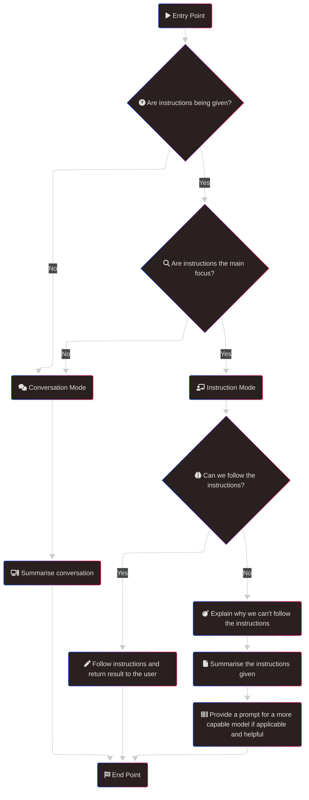

# Super Summariser Ultra Pro Max

## Flow

```mermaid
---
id: d22fae4c-efa7-404f-b1df-2437f43e1477
config:
  theme: neo-dark
  look: neo
  layout: elk
---
flowchart TB
    %% Nodes
    canFollow{"fa:fa-brain Can we follow the instructions?"}
    converseMode("fa:fa-comments Conversation Mode")
    craftPrompt("fa:fa-barcode Provide a prompt for a more capable model if applicable and helpful")
    detectInstructions{"fa:fa-question-circle Are instructions being given?"}
    endPoint("fa:fa-flag-checkered End Point")
    entryPoint("fa:fa-play Entry Point")
    explainFailure("fa:fa-bomb Explain why we can't follow the instructions")
    followInstructions("fa:fa-pen Follow instructions and return result to the user")
    instructionsMain{"fa:fa-magnifying-glass Are instructions the main focus?"}
    instructMode("fa:fa-chalkboard-teacher Instruction Mode")
    summariseConversation("fa:fa-computer Summarise conversation")
    summariseInstructions("fa:fa-file Summarise the instructions given")

    %% Connections
    canFollow -- No --> explainFailure
    canFollow -- Yes --> followInstructions
    converseMode --> summariseConversation
    craftPrompt --> endPoint
    detectInstructions -- No --> converseMode
    detectInstructions -- Yes --> instructionsMain
    entryPoint --> detectInstructions
    explainFailure --> summariseInstructions
    followInstructions --> endPoint
    instructionsMain -- No --> converseMode
    instructionsMain -- Yes --> instructMode
    instructMode --> canFollow
    summariseConversation --> endPoint
    summariseInstructions --> craftPrompt
```
