# Omi Summariser Processing Flow

```mermaid
---
id: omi-summariser-detailed-flow
config:
  theme: neo-dark
  look: neo
  layout: elk
---
flowchart TD
    %% ============================================
    %% ENTRY & INPUT
    %% ============================================
    entryPoint("fa:fa-play Entry Point")
    receiveTranscript("fa:fa-file-audio Receive Conversation Transcript")

    %% ============================================
    %% PRE-ANALYSIS PHASE
    %% ============================================
    cleanTranscript("fa:fa-broom Clean Transcript Mentally<br/>Interpret intended meaning<br/>Note unclear sections")
    identifyTheme{"fa:fa-tags Identify Dominant Theme"}
    detectSessions{"fa:fa-layer-group Multiple Sessions?"}
    splitSessions("fa:fa-code-branch Split into Mini-Summaries<br/>Process chronologically")
    proceedSingle("fa:fa-arrow-right Proceed with Single Session")

    %% Theme Options
    themeBusiness("fa:fa-briefcase Business/Professional")
    themePersonal("fa:fa-users Personal/Social")
    themeContent("fa:fa-podcast Content Consumption")
    themeBrainstorm("fa:fa-lightbulb Brainstorm/Creative")
    themeTraining("fa:fa-graduation-cap Training/Educational")
    themeSales("fa:fa-handshake Sales/Negotiation")
    themeOther("fa:fa-ellipsis Other")

    %% ============================================
    %% MODE DETECTION
    %% ============================================
    detectInstructions{"fa:fa-question-circle Are instructions<br/>being given?"}
    instructionsMain{"fa:fa-magnifying-glass Are instructions<br/>the main focus?"}

    %% ============================================
    %% CONVERSATION MODE
    %% ============================================
    converseMode("fa:fa-comments Conversation Mode")
    generateSummary("fa:fa-file-lines Generate Summary<br/>≤5 sentences, theme-aware opening")
    generateAtmosphere("fa:fa-cloud Capture Atmosphere<br/>1 sentence mood/energy")
    generateMetadata("fa:fa-table Generate Metadata<br/>Duration, Topics, Speakers")
    extractDecisions("fa:fa-gavel Extract Decisions Made")
    extractActions("fa:fa-tasks Extract Action Items<br/>With owners & due dates")
    extractCommitments("fa:fa-handshake-angle Extract Commitments<br/>Categorise: Commitment, Request,<br/>Timing, Decision, Valuable Info")
    extractTakeaways("fa:fa-key Extract Key Takeaways<br/>3-7 points with statistics")
    identifyQuestions("fa:fa-circle-question Identify Unanswered Questions")
    analyseBlindSpots("fa:fa-eye-slash Analyse Blind Spots & Gaps")
    analyseCommunication("fa:fa-chart-line Analyse Communication<br/>Sentiment, Biases, Quality")
    extractPersonalNotes("fa:fa-sticky-note Extract Personal Notes/Reminders")
    identifyParticipants("fa:fa-user-group Identify Participants<br/>Real names only")
    selectQuotes("fa:fa-quote-left Select Notable Quotes<br/>0-3 maximum")
    identifyNextSteps("fa:fa-forward Identify Next Steps")

    %% ============================================
    %% INSTRUCTION MODE
    %% ============================================
    instructMode("fa:fa-chalkboard-teacher Instruction Mode")
    canFollow{"fa:fa-brain Can we follow<br/>the instructions?"}
    assessCapability("fa:fa-gauge Assess:<br/>• Model capabilities<br/>• Instruction clarity<br/>• Available context<br/>• Task feasibility")

    %% Will Follow Branch
    followInstructions("fa:fa-pen Follow Instructions")
    returnResult("fa:fa-check-circle Return Result to User")

    %% Can't Follow Branch
    explainFailure("fa:fa-bomb Explain Why<br/>We Can't Follow")
    summariseInstructions("fa:fa-file-contract Summarise Instructions Given")
    assessEscalation{"fa:fa-arrow-up Would escalation<br/>be helpful?"}
    craftPrompt("fa:fa-wand-magic-sparkles Craft Prompt for<br/>More Capable Model")
    skipEscalation("fa:fa-forward-step Skip Escalation")

    %% ============================================
    %% OUTPUT & PERSISTENCE
    %% ============================================
    assembleOutput("fa:fa-puzzle-piece Assemble Output<br/>Omit empty sections")
    applyFormatting("fa:fa-palette Apply Formatting<br/>British English, Markdown")
    updateMemory("fa:fa-brain Update Memory<br/>Persistent context")
    updateActions("fa:fa-list-check Update Actions<br/>Future tasks")
    deliverOutput("fa:fa-paper-plane Deliver Output")
    endPoint("fa:fa-flag-checkered End Point")

    %% ============================================
    %% GUIDING PRINCIPLES (Cross-cutting)
    %% ============================================
    principles("fa:fa-compass Guiding Principles<br/>Extract only • Prioritise utility<br/>Handle imperfect input • Be objective<br/>Flag uncertainty")

    %% ============================================
    %% CONNECTIONS - Entry & Pre-Analysis
    %% ============================================
    entryPoint --> receiveTranscript
    receiveTranscript --> cleanTranscript
    cleanTranscript --> identifyTheme

    %% Theme branching (all converge back)
    identifyTheme --> themeBusiness
    identifyTheme --> themePersonal
    identifyTheme --> themeContent
    identifyTheme --> themeBrainstorm
    identifyTheme --> themeTraining
    identifyTheme --> themeSales
    identifyTheme --> themeOther

    themeBusiness --> detectSessions
    themePersonal --> detectSessions
    themeContent --> detectSessions
    themeBrainstorm --> detectSessions
    themeTraining --> detectSessions
    themeSales --> detectSessions
    themeOther --> detectSessions

    %% Session detection
    detectSessions -- "Yes" --> splitSessions
    detectSessions -- "No" --> proceedSingle
    splitSessions --> detectInstructions
    proceedSingle --> detectInstructions

    %% ============================================
    %% CONNECTIONS - Mode Detection
    %% ============================================
    detectInstructions -- "No" --> converseMode
    detectInstructions -- "Yes" --> instructionsMain
    instructionsMain -- "No<br/>(instructions are incidental)" --> converseMode
    instructionsMain -- "Yes<br/>(instructions are primary)" --> instructMode

    %% ============================================
    %% CONNECTIONS - Conversation Mode Flow
    %% ============================================
    converseMode --> generateSummary
    generateSummary --> generateAtmosphere
    generateAtmosphere --> generateMetadata
    generateMetadata --> extractDecisions
    extractDecisions --> extractActions
    extractActions --> extractCommitments
    extractCommitments --> extractTakeaways
    extractTakeaways --> identifyQuestions
    identifyQuestions --> analyseBlindSpots
    analyseBlindSpots --> analyseCommunication
    analyseCommunication --> extractPersonalNotes
    extractPersonalNotes --> identifyParticipants
    identifyParticipants --> selectQuotes
    selectQuotes --> identifyNextSteps
    identifyNextSteps --> assembleOutput

    %% ============================================
    %% CONNECTIONS - Instruction Mode Flow
    %% ============================================
    instructMode --> assessCapability
    assessCapability --> canFollow

    %% Success path
    canFollow -- "Yes" --> followInstructions
    followInstructions --> returnResult
    returnResult --> assembleOutput

    %% Failure path
    canFollow -- "No" --> explainFailure
    explainFailure --> summariseInstructions
    summariseInstructions --> assessEscalation
    assessEscalation -- "Yes" --> craftPrompt
    assessEscalation -- "No" --> skipEscalation
    craftPrompt --> assembleOutput
    skipEscalation --> assembleOutput

    %% ============================================
    %% CONNECTIONS - Output & Persistence
    %% ============================================
    assembleOutput --> applyFormatting
    applyFormatting --> updateMemory
    applyFormatting --> updateActions
    updateMemory --> deliverOutput
    updateActions --> deliverOutput
    deliverOutput --> endPoint

    %% Guiding principles influence all processing
    principles -.-> cleanTranscript
    principles -.-> converseMode
    principles -.-> instructMode
    principles -.-> assembleOutput

    %% ============================================
    %% SUBGRAPHS
    %% ============================================
    subgraph input["fa:fa-inbox Input"]
        entryPoint
        receiveTranscript
    end

    subgraph preAnalysis["fa:fa-microscope Pre-Analysis Phase"]
        cleanTranscript
        identifyTheme
        detectSessions
        splitSessions
        proceedSingle
        subgraph themes["fa:fa-swatchbook Theme Classification"]
            themeBusiness
            themePersonal
            themeContent
            themeBrainstorm
            themeTraining
            themeSales
            themeOther
        end
    end

    subgraph modeDetection["fa:fa-code-branch Mode Detection"]
        detectInstructions
        instructionsMain
    end

    subgraph conversation["fa:fa-comments Conversation Mode Processing"]
        converseMode
        subgraph outputGeneration["fa:fa-cogs Output Section Generation"]
            generateSummary
            generateAtmosphere
            generateMetadata
            extractDecisions
            extractActions
            extractCommitments
            extractTakeaways
            identifyQuestions
            analyseBlindSpots
            analyseCommunication
            extractPersonalNotes
            identifyParticipants
            selectQuotes
            identifyNextSteps
        end
    end

    subgraph instruction["fa:fa-chalkboard-teacher Instruction Mode Processing"]
        instructMode
        assessCapability
        canFollow
        subgraph willFollow["fa:fa-check Success Path"]
            followInstructions
            returnResult
        end
        subgraph cantFollow["fa:fa-times Failure Path"]
            explainFailure
            summariseInstructions
            assessEscalation
            craftPrompt
            skipEscalation
        end
    end

    subgraph output["fa:fa-arrow-right-from-bracket Output & Persistence"]
        assembleOutput
        applyFormatting
        updateMemory
        updateActions
        deliverOutput
        endPoint
    end

    subgraph guidingPrinciples["fa:fa-scale-balanced Cross-Cutting Concerns"]
        principles
    end
```

## Flow Description

### 1. Input Phase

The process begins when a conversation transcript is received. This could be from any source - meetings, casual chats, interviews, or content consumption.

### 2. Pre-Analysis Phase

Before determining the processing mode, three critical steps occur:

1. **Clean Transcript**: Interpret intended meaning from potentially garbled transcription, noting any critically unclear sections
2. **Identify Theme**: Classify the dominant conversation type (Business, Personal, Content, Brainstorm, Training, Sales, or Other)
3. **Detect Sessions**: If multiple distinct conversations exist, split them for separate processing in chronological order

### 3. Mode Detection

Two key decisions determine the processing path:

| Decision                         | Yes                 | No                  |
| -------------------------------- | ------------------- | ------------------- |
| Are instructions being given?    | Check if main focus | → Conversation Mode |
| Are instructions the main focus? | → Instruction Mode  | → Conversation Mode |

### 4. Conversation Mode

Processes general conversations through 15 sequential output sections:

- Summary, Atmosphere, Metadata
- Decisions, Actions, Commitments
- Takeaways, Questions, Blind Spots
- Communication Analysis, Personal Notes
- Participants, Quotes, Next Steps

### 5. Instruction Mode

Branches based on capability assessment:

| Path        | Condition               | Actions                                                  |
| ----------- | ----------------------- | -------------------------------------------------------- |
| **Success** | Can follow instructions | Execute → Return result                                  |
| **Failure** | Cannot follow           | Explain → Summarise → (Optional) Craft escalation prompt |

### 6. Output & Persistence

All paths converge to:

1. Assemble output (omitting empty sections)
2. Apply formatting (British English, Markdown)
3. Update Memory and Actions in parallel
4. Deliver final output

### Guiding Principles (Cross-Cutting)

These principles influence all processing stages:

- **Extract only** - Never invent information
- **Prioritise utility** - Every word should help understanding or action
- **Handle imperfect input** - Focus on meaning over literal text
- **Be objective** - Represent without editorial spin
- **Flag uncertainty** - State ambiguity rather than guess
