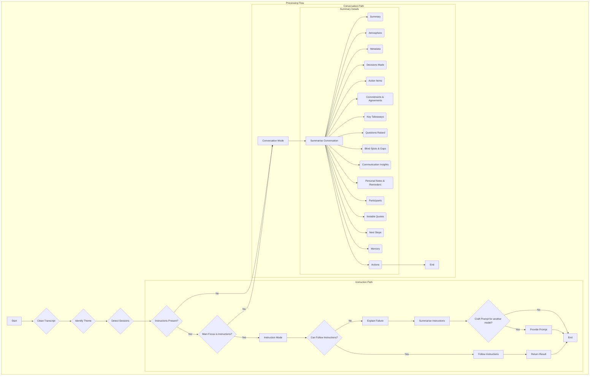

# Omi Summariser Flow

```mermaid
flowchart TD
    subgraph "Processing Flow"
        A[Start] --> B{Clean Transcript};
        B --> C{Identify Theme};
        C --> D{Detect Sessions};
        D --> E{Instructions Present?};

        subgraph "Instruction Path"
            direction LR
            E -- Yes --> F{Main Focus is Instructions?};
            F -- Yes --> G[Instruction Mode];
            G --> H{Can Follow Instructions?};
            H -- Yes --> I[Follow Instructions];
            I --> J[Return Result];
            H -- No --> K[Explain Failure];
            K --> L[Summarise Instructions];
            L --> M{Craft Prompt for another model?};
            M -- Yes --> N[Provide Prompt];
            M -- No --> O[End];
            N --> O;
            J --> O;
        end

        subgraph "Conversation Path"
            direction TD
            E -- No --> P[Conversation Mode];
            F -- No --> P;
            P --> Q[Summarise Conversation];

            subgraph "Summary Details"
                direction TB
                Q --> R(Summary);
                Q --> S(Atmosphere);
                Q --> T(Metadata);
                Q --> U(Decisions Made);
                Q --> V(Action Items);
                Q --> W(Commitments & Agreements);
                Q --> X(Key Takeaways);
                Q --> Y(Questions Raised);
                Q --> Z(Blind Spots & Gaps);
                Q --> AA(Communication Insights);
                Q --> AB(Personal Notes & Reminders);
                Q --> AC(Participants);
                Q --> AD(Notable Quotes);
                Q --> AE(Next Steps);
                Q --> AF(Memory);
                Q --> AG(Actions);
            end
            AG --> AH[End];
        end
    end
```
