# Omi Summariser Processing Flow

This diagram shows the complete processing flow for the Omi conversation summariser, including mode detection, pre-analysis steps, and output generation.

```mermaid
---
id: omi-summariser-full-flow
config:
  theme: neo-dark
  look: neo
  layout: elk
---
flowchart TD
    %% ============================================
    %% ENTRY AND INITIAL PROCESSING
    %% ============================================

    entryPoint(["fa:fa-play START: Receive Transcript"])

    %% Pre-Analysis Phase
    cleanTranscript["fa:fa-broom Clean Transcript Mentally
    - Interpret garbled text
    - Note unclear sections"]

    identifyTheme{"fa:fa-tag Identify Dominant Theme"}

    themeBusiness["Business/Professional"]
    themePersonal["Personal/Social"]
    themeContent["Content Consumption
    (podcast, video, lecture)"]
    themeBrainstorm["Brainstorm/Creative"]
    themeTraining["Training/Educational"]
    themeSales["Sales/Negotiation"]
    themeOther["Other (specify)"]

    detectSessions{"fa:fa-calendar-alt Multiple Sessions?"}

    splitSessions["fa:fa-scissors Split into
    chronological mini-summaries"]

    singleSession["fa:fa-file-alt Process as
    single conversation"]

    %% ============================================
    %% MODE DETECTION (from conversation-prompt.md)
    %% ============================================

    detectInstructions{"fa:fa-question-circle Are instructions
    being given?"}

    instructionsMain{"fa:fa-magnifying-glass Are instructions
    the MAIN focus?"}

    %% ============================================
    %% CONVERSATION MODE PATH
    %% ============================================

    converseMode(["fa:fa-comments CONVERSATION MODE"])

    summariseConversation["fa:fa-file-text Generate Full Summary
    following Output Format"]

    %% ============================================
    %% INSTRUCTION MODE PATH
    %% ============================================

    instructMode(["fa:fa-chalkboard-teacher INSTRUCTION MODE"])

    canFollow{"fa:fa-brain Can we follow
    the instructions?"}

    %% Success Path
    followInstructions["fa:fa-pen Follow Instructions
    Return result to user"]

    %% Failure Path
    explainFailure["fa:fa-bomb Explain Why
    Cannot follow instructions"]

    summariseInstructions["fa:fa-file Summarise
    the instructions given"]

    craftPrompt["fa:fa-barcode Provide prompt
    for more capable model
    (if applicable/helpful)"]

    %% ============================================
    %% OUTPUT GENERATION (Conversation Mode)
    %% ============================================

    outputStart(["fa:fa-file-export Begin Output Generation"])

    genSummary["### Summary
    ≤5 sentences
    Theme-aware opener
    Optional apt quote"]

    genAtmosphere["### Atmosphere
    ✨ One sentence
    mood and energy"]

    genMetadata["### Metadata
    Duration, Topics, Speakers"]

    checkDecisions{"Decisions made?"}
    genDecisions["### Decisions Made
    Topic + approval/rejection/commitment"]

    checkActions{"Actions identified?"}
    genActions["### Action Items
    🔵🟢 emoji bullets
    @Name + due date if stated"]

    checkCommitments{"Commitments found?"}
    genCommitments["### Commitments & Agreements
    Categories: Commitment, Request,
    Timing, Decision, Valuable Info
    3-5 most critical"]

    genTakeaways["### Key Takeaways
    3-7 points max
    Include stats/figures"]

    checkQuestions{"Unanswered questions?"}
    genQuestions["### Questions Raised
    Unanswered questions
    needing follow-up"]

    checkBlindSpots{"Gaps or blind spots?"}
    genBlindSpots["### Blind Spots & Gaps
    - Unanswered Questions
    - Skipped/Deflected Topics
    - Unclear Elements
    - Implicit Assumptions"]

    genSentiment["### Communication Insights
    Sentiment table (Pos/Neu/Neg)
    Potential biases
    Communication quality notes"]

    checkPersonalNotes{"Personal notes found?"}
    genPersonalNotes["### Personal Notes & Reminders
    Explicit or implicit notes"]

    checkParticipants{"Real names captured?"}
    genParticipants["### Participants
    Name (role if stated)"]

    checkQuotes{"Notable quotes?"}
    genQuotes["### Notable Quotes
    0-3 maximum
    Genuinely striking statements"]

    checkNextSteps{"Next steps discussed?"}
    genNextSteps["### Next Steps
    Specific next actions"]

    genMemory["### Memory
    Items to remember
    for user/model"]

    genActionsSection["### Actions
    Future actions required"]

    %% ============================================
    %% END POINTS
    %% ============================================

    endConversation(["fa:fa-flag-checkered END: Conversation Summary Complete"])
    endInstruction(["fa:fa-flag-checkered END: Instruction Result Delivered"])
    endCantFollow(["fa:fa-flag-checkered END: Explained Limitation + Prompt Provided"])

    %% ============================================
    %% CONNECTIONS - Entry Flow
    %% ============================================

    entryPoint --> cleanTranscript
    cleanTranscript --> identifyTheme

    identifyTheme --> themeBusiness
    identifyTheme --> themePersonal
    identifyTheme --> themeContent
    identifyTheme --> themeBrainstorm
    identifyTheme --> themeTraining
    identifyTheme --> themeSales
    identifyTheme --> themeOther

    themeBusiness --> detectSessions
    themePersonal --> detectSessions
    themeContent --> detectSessions
    themeBrainstorm --> detectSessions
    themeTraining --> detectSessions
    themeSales --> detectSessions
    themeOther --> detectSessions

    detectSessions -- Yes --> splitSessions
    detectSessions -- No --> singleSession

    splitSessions --> detectInstructions
    singleSession --> detectInstructions

    %% ============================================
    %% CONNECTIONS - Mode Detection
    %% ============================================

    detectInstructions -- No --> converseMode
    detectInstructions -- Yes --> instructionsMain

    instructionsMain -- No --> converseMode
    instructionsMain -- Yes --> instructMode

    %% ============================================
    %% CONNECTIONS - Conversation Mode
    %% ============================================

    converseMode --> outputStart
    outputStart --> genSummary
    genSummary --> genAtmosphere
    genAtmosphere --> genMetadata
    genMetadata --> checkDecisions

    checkDecisions -- Yes --> genDecisions
    checkDecisions -- No --> checkActions
    genDecisions --> checkActions

    checkActions -- Yes --> genActions
    checkActions -- No --> checkCommitments
    genActions --> checkCommitments

    checkCommitments -- Yes --> genCommitments
    checkCommitments -- No --> genTakeaways
    genCommitments --> genTakeaways

    genTakeaways --> checkQuestions

    checkQuestions -- Yes --> genQuestions
    checkQuestions -- No --> checkBlindSpots
    genQuestions --> checkBlindSpots

    checkBlindSpots -- Yes --> genBlindSpots
    checkBlindSpots -- No --> genSentiment
    genBlindSpots --> genSentiment

    genSentiment --> checkPersonalNotes

    checkPersonalNotes -- Yes --> genPersonalNotes
    checkPersonalNotes -- No --> checkParticipants
    genPersonalNotes --> checkParticipants

    checkParticipants -- Yes --> genParticipants
    checkParticipants -- No --> checkQuotes
    genParticipants --> checkQuotes

    checkQuotes -- Yes --> genQuotes
    checkQuotes -- No --> checkNextSteps
    genQuotes --> checkNextSteps

    checkNextSteps -- Yes --> genNextSteps
    checkNextSteps -- No --> genMemory
    genNextSteps --> genMemory

    genMemory --> genActionsSection
    genActionsSection --> endConversation

    %% ============================================
    %% CONNECTIONS - Instruction Mode
    %% ============================================

    instructMode --> canFollow

    canFollow -- Yes --> followInstructions
    canFollow -- No --> explainFailure

    followInstructions --> endInstruction

    explainFailure --> summariseInstructions
    summariseInstructions --> craftPrompt
    craftPrompt --> endCantFollow

    %% ============================================
    %% SUBGRAPHS
    %% ============================================

    subgraph preAnalysis ["fa:fa-search PRE-ANALYSIS PHASE"]
        cleanTranscript
        identifyTheme
        themeBusiness
        themePersonal
        themeContent
        themeBrainstorm
        themeTraining
        themeSales
        themeOther
        detectSessions
        splitSessions
        singleSession
    end

    subgraph modeDetection ["fa:fa-code-branch MODE DETECTION"]
        detectInstructions
        instructionsMain
    end

    subgraph conversationPath ["fa:fa-comments CONVERSATION MODE PATH"]
        converseMode
        outputStart
        subgraph requiredSections ["Always Generated"]
            genSummary
            genAtmosphere
            genMetadata
            genTakeaways
            genSentiment
            genMemory
            genActionsSection
        end
        subgraph conditionalSections ["Generated If Applicable"]
            checkDecisions
            genDecisions
            checkActions
            genActions
            checkCommitments
            genCommitments
            checkQuestions
            genQuestions
            checkBlindSpots
            genBlindSpots
            checkPersonalNotes
            genPersonalNotes
            checkParticipants
            genParticipants
            checkQuotes
            genQuotes
            checkNextSteps
            genNextSteps
        end
    end

    subgraph instructionPath ["fa:fa-chalkboard-teacher INSTRUCTION MODE PATH"]
        instructMode
        canFollow
        subgraph successPath ["fa:fa-check CAN FOLLOW"]
            followInstructions
        end
        subgraph failurePath ["fa:fa-times CANNOT FOLLOW"]
            explainFailure
            summariseInstructions
            craftPrompt
        end
    end

    subgraph endpoints ["fa:fa-flag ENDPOINTS"]
        endConversation
        endInstruction
        endCantFollow
    end
```

## Flow Description

### 1. Entry & Pre-Analysis

1. **Receive Transcript** - The process begins when a conversation transcript is provided
2. **Clean Transcript** - Mentally interpret transcription errors, note unclear sections
3. **Identify Theme** - Categorise as one of:
   - Business/Professional
   - Personal/Social
   - Content Consumption (podcast, video, lecture)
   - Brainstorm/Creative
   - Training/Educational
   - Sales/Negotiation
   - Other
4. **Detect Sessions** - Check if multiple conversations exist; if so, split chronologically

### 2. Mode Detection

Two critical decision points determine processing mode:

1. **Are instructions being given?**
   - No → Conversation Mode
   - Yes → Check if main focus

2. **Are instructions the MAIN focus?**
   - No → Conversation Mode (instructions are incidental)
   - Yes → Instruction Mode

### 3. Conversation Mode

Generates a structured summary with:

**Always Generated:**

- Summary (≤5 sentences, theme-aware)
- Atmosphere (✨ one sentence)
- Metadata (duration, topics, speakers)
- Key Takeaways (3-7 points)
- Communication Insights (sentiment, biases, quality)
- Memory section
- Actions section

**Conditionally Generated (omit if empty):**

- Decisions Made
- Action Items
- Commitments & Agreements
- Questions Raised
- Blind Spots & Gaps
- Personal Notes & Reminders
- Participants (only if real names captured)
- Notable Quotes (0-3 max)
- Next Steps

### 4. Instruction Mode

**Can Follow Instructions:**

- Execute instructions directly
- Return result to user
- END

**Cannot Follow Instructions:**

1. Explain why the instructions cannot be followed
2. Summarise what the instructions were asking for
3. Provide a prompt for a more capable model (if helpful)
4. END

## Guiding Principles (from Personality)

- **Extract only** - never invent information
- **Prioritise utility** - every word should help user understand or act
- **Handle imperfect input** - focus on meaning over literal text
- **Be objective** - no editorial spin or moral filtering
- **Flag uncertainty** - acknowledge ambiguity rather than guess
- **British English** - spelling throughout
- **Concise** - substance over style, but warmth welcome
