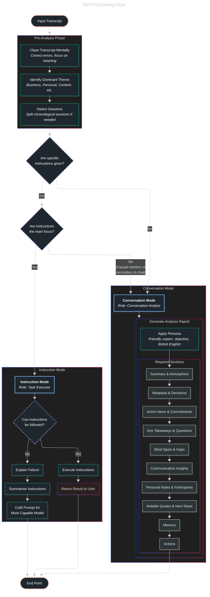

# Omi Summariser Processing Flow

```mermaid
---
title: Omi Processing Flow
config:
  theme: neo-dark
  look: neo
  layout: elk
---
flowchart TD
    %% Entry
    Start([Input Transcript]) --> PreProc

    %% Pre-Processing
    subgraph PreProc [Pre-Analysis Phase]
        direction TB
        Clean[Clean Transcript Mentally<br/><i>Correct errors, focus on meaning</i>]
        Theme[Identify Dominant Theme<br/><i>Business, Personal, Content, etc.</i>]
        Sessions[Detect Sessions<br/><i>Split chronological sessions if needed</i>]
        Clean --> Theme --> Sessions
    end

    PreProc --> DetectInstr

    %% Decision Logic
    DetectInstr{Are specific<br/>instructions given?}
    DetectInstr -- No --> ConvMode
    DetectInstr -- Yes --> CheckFocus

    CheckFocus{Are instructions<br/>the main focus?}
    CheckFocus -- No<br/><i>(Casual mention or<br/>secondary to chat)</i> --> ConvMode
    CheckFocus -- Yes --> InstrMode

    %% Conversation Mode Path
    subgraph ConversationMode [Conversation Mode]
        direction TB
        ConvMode[<b>Conversation Mode</b><br/><i>Role: Conversation Analyst</i>]

        subgraph AnalysisGeneration [Generate Analysis Report]
            direction TB
            Style[Apply Persona<br/><i>Friendly, expert, objective, British English</i>]

            subgraph OutputSections [Required Sections]
                Summary[Summary & Atmosphere]
                Meta[Metadata & Decisions]
                ActionItems[Action Items & Commitments]
                Takeaways[Key Takeaways & Questions]
                BlindSpots[Blind Spots & Gaps]
                Insights[Communication Insights]
                Notes[Personal Notes & Participants]
                Quotes[Notable Quotes & Next Steps]
                Memory[Memory]
                FinalActions[Actions]
            end

            Style --> Summary
            Summary --> Meta --> ActionItems --> Takeaways --> BlindSpots --> Insights --> Notes --> Quotes --> Memory --> FinalActions
        end

        ConvMode --> AnalysisGeneration
    end

    FinalActions --> End([End Point])

    %% Instruction Mode Path
    subgraph InstructionMode [Instruction Mode]
        direction TB
        InstrMode[<b>Instruction Mode</b><br/><i>Role: Task Executor</i>]

        CanFollow{Can instructions<br/>be followed?}

        InstrMode --> CanFollow

        %% Success Path
        CanFollow -- Yes --> Exec[Execute Instructions]
        Exec --> Result[Return Result to User]

        %% Failure Path
        CanFollow -- No --> Explain[Explain Failure]
        Explain --> Summarise[Summarise Instructions]
        Summarise --> Prompt[Craft Prompt for<br/>More Capable Model]
    end

    Result --> End
    Prompt --> End

    %% Styling
    classDef mode fill:#1e272e,stroke:#74b9ff,stroke-width:2px,color:#fff;
    classDef decision fill:#1e272e,stroke:#a29bfe,stroke-width:2px,stroke-dasharray: 5 5,color:#fff;
    classDef process fill:#1e272e,stroke:#00b894,stroke-width:1px,color:#fff;
    classDef term fill:#1e272e,stroke:#fab1a0,stroke-width:2px,color:#fff;
    classDef sectionNode fill:#2d3436,stroke:#dfe6e9,stroke-width:1px,color:#dfe6e9;

    class ConvMode,InstrMode mode;
    class DetectInstr,CheckFocus,CanFollow decision;
    class Clean,Theme,Sessions,Style,Exec,Explain,Summarise,Prompt process;
    class Summary,Meta,ActionItems,Takeaways,BlindSpots,Insights,Notes,Quotes,Memory,FinalActions sectionNode;
    class Start,End term;
```
